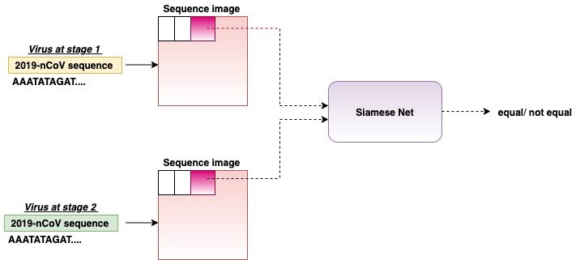
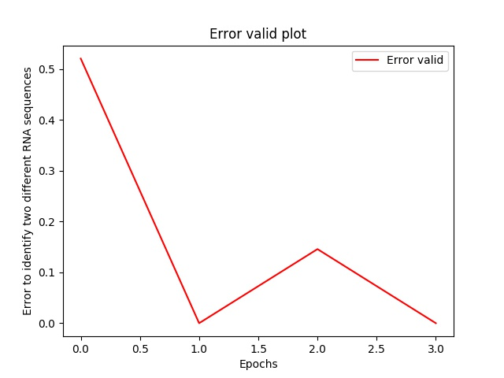
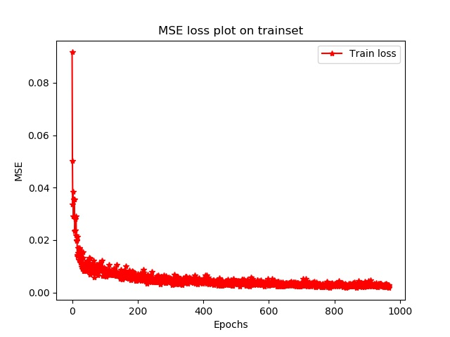
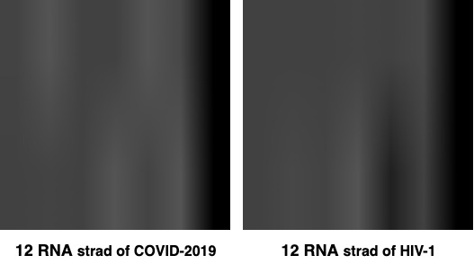

# Artificial Intelligence model for COVID-2019 analysis 

## Purpose 

Deep learning application idea to track COVID-2019 virus evolution by analyzing the RNA sequence between two COVID-2019 samples at different time points (i.e for example December COVID-2019  and the current one). 

The system is still under development and does not currently guarantee any immediate application. 

This was done as the purpose of creating an interface between the COVID-2019 sequences currently available and deep learning to guarantee future applications in this direction and speed up the creation of a vaccine.

The network is based on a deep Siamese Neural Network (https://en.wikipedia.org/wiki/Siamese_neural_network) that takes a strand of RAN COVID-2019 sequences as input - taken at different time points instants.

More specifically, each strand is converted into a grayscale image of 256x256 pixels size and passed through two AlexNet (https://papers.nips.cc/paper/4824-imagenet-classification-with-deep-convolutional-neural-networks.pdf) Convolutional Networks (CNN). However, both CNN are trained towards negative examples with Human Immunodeficiency Viruses (HIV) strand examples (i.e how it is a biologically different virus).

The aim is to find nucleotide sequences that stably characterizes COVID-2019 for finding a specific RNA biomarker strand.
In particular, it might be useful to compare the variation over time of the densely glycosylated spike (S) protein sequences which coronavirus uses to enter in the host cell (https://science.sciencemag.org/content/early/2020/02/19/science.abb2507/tab-pdf).

This work is in progress and since I do it in my spare time.

However, understanding the urgency of the phenomenon, I decided to make the code available to give new analysis tools to the international scientific community. 


### Wuhan-Hu-1 isolated coronavirus 2 complete genome sequences have been downloaded from link below and saved in the project folder ./virus_genome

https://www.ncbi.nlm.nih.gov/nuccore/MN908947.3?report=fasta

### The Human Immunodeficiency Viruses (HIV) complete genome sequence has been downloaded from link below and saved in the project folder ./virus_genome

https://www.ncbi.nlm.nih.gov/nuccore/NC_001722.1?report=fasta


The code is released for research purposes only and not for commercial purposes.




## RESULTS

In the first phase, the Siamese Neural Network system was trained against strands of RAN derived from the HIV-1 virus which presents biological diversity compared to COVID-2019.

As you can see from the graph, the system is able to identify the difference between RNA strands of coronavirus from HIV with a sensitivity that is around 70% (i.e. probably with deeper networks the system has greater accuracy). 

In particular, I want to look for similarities between spike proteins
of HIV-1 and those of 2019-nCoV, wherein a recent article "Uncanny similarity of unique inserts in the 2019-nCoV spike protein to HIV-1 gp120 and Gag" is underlined their structural similarity of amino acid residues with the HIV-1 (https://www.biorxiv.org/content/10.1101/2020.01.30.927871v1.full.pdf).

This is also useful for the creation of an RNA identification system for specific sequences that presented mutations during the epidemic evolution of the 2019-nCoV virus.

### Sensitivity plot 



### Training MSE plot




The system input turns out to be a sequence of 12 RNA bases (i.e. that code for 4 amino acids). Each RNA string is converted into an image to give input to the convolutional network. 

Below an example of a 12 RNA sequence of coronavirus and an HIV-1 one converting to 256x256 pixels images.




## MODELS DOWNLOAD

### Download Alexnet 2019-nCoV Siamese Neural Network model from this link:

https://drive.google.com/file/d/12iMuo-pXG7APxDzBKthOvF6xFgKSopg-/view?usp=sharing


## USE

* Generation of the dataset (COVID-2019 vs HIV) - go to ./get_dataset folder then open main file change the paths of the HIV and COVID-2019 sequences and the folder where to save the dataset.

* I used two AlexNet networks pretrained on imagenet (http://www.image-net.org/).   

```
sh run.sh
```

For running the training

## TODO

* Test with different length of RNA sequences
* Build an inference system to analyze strands RNA length between two different coranaviruses sequence.


### Prerequisites

Before getting started, it's important to have a working environment with all dependencies satisfied. For this, we recommend using the Anaconda distribution of Python 3.5.

```
cd /tmp
curl -O https://repo.anaconda.com/archive/Anaconda3-2019.03-Linux-x86_64.sh
bash Anaconda3-2019.03-Linux-x86_64.sh
```

So pytorch must be installed, please make sure that cuDNN is installed correctly (https://developer.nvidia.com/cudnn).

```
conda install pytorch torchvision cudatoolkit=9.2 -c pytorch
```

Then install the following libraries:

```
pip install torchvision
pip install opencv-python
pip install matplotlib
pip install tqdm
pip install textwrap3
pip install python-gflags
pip install text-to-image
```

### Installing

To start the training code: 

Please remember to change the path of where the dataset is located and where you want to save inside the train.py file


```
python train.py
```

## Authors

* ** Nicolò Savioli, PhD ** - *Initial work* 

Please if you find this code useful for all your research activities, cite it.


## License

This work is licensed under a Creative Commons Attribution-NonCommercial-ShareAlike 4.0 International License.

This [license](./LICENSE.md) applies to all published OONI data.
